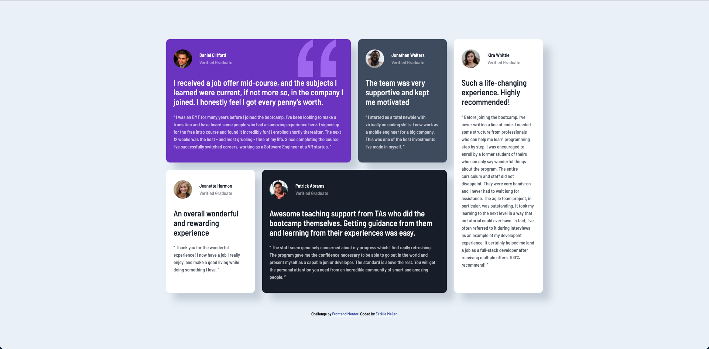

# Frontend Mentor - Testimonials grid section solution

This is a solution to the [Testimonials grid section challenge on Frontend Mentor](https://www.frontendmentor.io/challenges/testimonials-grid-section-Nnw6J7Un7). Frontend Mentor challenges help you improve your coding skills by building realistic projects. 

## Table of contents

- [Overview](#overview)
  - [The challenge](#the-challenge)
  - [Screenshot](#screenshot)
  - [Links](#links)
- [My process](#my-process)
  - [Built with](#built-with)
  - [What I learned](#what-i-learned)
  - [Continued development](#continued-development)
  - [Useful resources](#useful-resources)
- [Author](#author)
- [Acknowledgments](#acknowledgments)

**Note: Delete this note and update the table of contents based on what sections you keep.**

## Overview

### The challenge

Users should be able to:

- View the optimal layout for the site depending on their device's screen size

### Screenshot

### Links

- Live Site URL: https://testimonials-grid-section-main-psi-jade.vercel.app/(https://your-live-site-url.com)

## My process

### Built with

- Semantic HTML5 markup
- CSS
- Flexbox
- CSS Grid

### What I learned

I used this challenge to further get back to my HTML/CSS knowledge. 

- I learned that the best way to add something 'in the background' is to simply implement it as a background. This way you don't have to try and use z-index.
- I had to look up the whole grid concept, so I understand it again. Apart from the notation itself, I understood the concept. So that went well.
- Again I learned how to center content in a single view webpage, like previous challenges.

### Continued development

In future challenges I will probably dive into SASS or SCSS, as recommended in feedback given on earlier challenges.

## Author

- LinkedIn - Estèlle Meijer (https://www.linkedin.com/in/estèlle-meijer)
- Frontend Mentor - [@meijerestelle](https://www.frontendmentor.io/profile/meijerestelle)
- Twitter - [@estellemeijer](https://www.twitter.com/estellemeijer)
